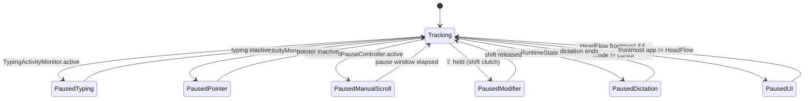

# PodsControlMac (HeadFlow)

### Cursor control, Hands-free scrolling, on-device dictation and soo much more for macOS using your AirPods / Beats

[Github Repo Link](https://github.com/sumionochi/PodsControlMac)

[1 min Demo Video on Mux](https://player.mux.com/4DQJQ8Z200VqHNem55ljpNwu7aEQUp5wf1poAgd0056hs)


PodsControlMac (codename: **HeadFlow**) is a macOS utility that turns your head movements into system-wide input:

- **Tilt your head** → scroll smoothly in any app  
- **Lean forward slightly** → auto-scroll for reading, teleprompter-style  
- **Turn your head** → move the mouse cursor, click, and drag, *without touching the trackpad*

Built with **Core Motion**, **CGEvent**, and **SwiftUI**, it’s designed to feel:

> ✨ Natural • 🔒 Safe • 🧠 Smart about when to get out of your way

---

## Table of Contents

1. [Demo Scenarios](#demo-scenarios)
2. [Feature Overview](#feature-overview)
3. [System Requirements](#system-requirements)
4. [Architecture Overview](#architecture-overview)
5. [Motion Pipeline](#motion-pipeline)
6. [Safety & Pause Logic](#safety--pause-logic)
7. [Per-App Profiles](#per-app-profiles)
8. [Cursor Mode](#cursor-mode)
9. [Gestures & Shortcuts](#gestures--shortcuts)
10. [Dictation & Voice Commands](#dictation--voice-commands)
11. [Preferences App](#preferences-app)
12. [Key Code Components](#key-code-components)
13. [Building & Running](#building--running)
14. [Future Ideas](#future-ideas)

---

## Building & Running

1. **Clone / open project**

   ```bash
   git clone <this-repo-url>
   cd PodsControlMac
   open PodsControlMac.xcodeproj   # or .xcworkspace if using SwiftPM/CocoaPods
   ```

2. **Open in Xcode** and select the **PodsControlMac** app target.

3. **Signing & Capabilities**

   * Set your Team and bundle identifier.
   * Ensure capabilities for:

     * Motion / Health (for CMHeadphoneMotionManager)
     * Hardened runtime (if applicable)

4. **Build & Run**

   * Run the app on your local Mac.

5. **Grant Permissions on first run**

   * When prompted:

     * Enable **Accessibility** for PodsControlMac in *System Settings → Privacy & Security → Accessibility*
     * Allow **Motion & Fitness** access for head tracking
     * Accept any prompts for input monitoring (if shown)

6. **Connect headphones & start**

   * Put on compatible AirPods / Beats
   * Ensure they show as your audio output device
   * Open PodsControlMac from the menu bar
   * Use the global shortcut to start/stop HeadFlow, or toggle from the UI
   * Use the calibrate shortcut to set your neutral head position
  * How much manual scrolling vs head scrolling you’re doing
  * Which apps you use HeadFlow with the most

---

## Demo Scenarios

### 1. Long article / PDF reading

1. Put on your AirPods / compatible headphones  
2. Open Safari or your PDF reader  
3. Switch to **Auto-read** mode  
4. Slightly tilt your head down ➝ the page auto-scrolls at a readable pace  
5. Straighten your head ➝ scrolling eases to a stop  
6. Start typing ➝ head scrolling pauses automatically so it never fights you

---

### 2. One-handed browsing / coding

1. Switch to **Continuous** mode  
2. Lean your head back/forward to scroll up/down  
3. Move your mouse or trackpad ➝ HeadFlow detects pointer activity and backs off  
4. Use a global shortcut (e.g. ⇧⌘H) to temporarily toggle HeadFlow without touching the menu bar

---

### 3. Full **cursor control** with head movements

1. Switch to **Cursor** mode  
2. Turn your head left/right ➝ cursor moves horizontally  
3. Tilt your head up/down ➝ cursor moves vertically  
4. Turn your head past a configurable angle *while holding modifiers* ➝ single or double click  
5. Add extra modifier(s) ➝ same motion performs a drag

Example:

- Click = ⌘ (Command)  
- Drag = ⌘ + ⌃ (Command + Control)

Turn head right while holding ⌘ to click, then hold ⌘+⌃ and turn again to drag.

---

## Feature Overview

### Motion Modes

- **Continuous Scroll**
  - Scroll speed scales proportionally with head tilt
  - Smooth acceleration & damping using exponential smoothing
  - Configurable:
    - Scroll sensitivity (0–100)
    - Max lines at full tilt (0–500)
    - Dead zone (°)
    - Max tilt (°) for full speed
    - Acceleration & damping factors

- **Auto-read (Teleprompter)**
  - Slight downward tilt starts slow, steady downward scroll
  - Always scrolls down; straightening your head smoothly decelerates to zero
  - Lower max speed and more forgiving timing than continuous mode

- **Cursor Mode**
  - Yaw (turning left/right) → horizontal pointer movement
  - Pitch (up/down) → vertical pointer movement
  - Head turning beyond thresholds (with modifiers) triggers:
    - Single click
    - Double click
    - Click-and-drag via extra modifiers
  - Tunable:
    - Pointer speed
    - Pointer dead zone
    - Pointer smoothing
    - Single/double click yaw angle
    - Click cooldown
    - Modifier combinations for click & drag

---

### Safety & “Don’t Fight Me” Features

HeadFlow constantly asks: **“Is now a good time to move the page?”**  

It automatically **pauses** for:

- **Mouse / trackpad movement** (`PointerActivityMonitor`)
- **Typing** (`TypingActivityMonitor`)
- **Manual scrolling** (scroll wheel events from real hardware, not HeadFlow)
- **Dictation** (optional)
- **Shift clutch** – hold ⇧ to temporarily suspend head scrolling
- **When its own Preferences window is frontmost** (UI pause, no live updates)

Each safety feature is individually configurable in Preferences.

---

### Per-App Profiles

Different apps need different behavior. HeadFlow lets you create **per-app profiles**:

- Enable/disable HeadFlow in specific apps
- Per-app overrides for:
  - Scroll sensitivity
  - Max lines at full tilt
  - Dead zone
  - Max tilt
  - Scroll Mode (Continuous / Auto-read / Cursor)

Profiles are managed via `ProfileManager` and stored in `UserDefaults`.

---

### Gestures & Shortcuts

You can bind **head tilt gestures** to system actions:

- **Gestures** (detected via ROLL + YAW):
  - Tilt left
  - Tilt right
- Bindable actions:
  - HeadFlow actions (e.g. toggle, calibrate, change mode)
  - Standard macOS shortcuts (Cmd+C, Cmd+V, etc.)
  - Your own **custom shortcut bank** (any key + modifiers)

Global keyboard shortcuts (works system-wide):

- Toggle HeadFlow on/off  
- Create profile for current app  
- Open Preferences  
- Calibrate head position  
- Cycle modes (Continuous / Auto-read / Cursor)  
- Toggle dictation HUD  
- Toggle dictation mic

All are customizable from the **Shortcuts** tab with a pill-style shortcut recorder.

---

### Dictation & Voice Commands

HeadFlow can be paired with dictation to reduce keyboard usage:

- Optional: **Pause HeadFlow while dictating**  
- Optional: **Auto-commit** dictated text after X seconds of silence  
- **Custom dictation commands**:
  - “When I say: `new paragraph` → type: `\n\n`”
  - “When I say: `wrap this` → type: `{{ $SELECTION }}`” *(conceptually)*

Configured via a lightweight list of `DictationCommand` objects, exposed in Preferences as:

- Trigger phrase  
- Replacement text  

---

### Licensing / Trial

While the full implementation details are in `AccessGate`, conceptually:

- Trial mode with limited usage / time  
- One-time unlock for full access  
- Preferences include a **License** tab and a **TrialStatusBanner** at the top

The runtime checks `AccessGate.hasFullAccess` inside `MotionEngine`. If the trial is over and not unlocked, motion events are simply ignored.

---

## System Requirements

- **macOS 14.0 (Sonoma)** or later  
  (`@available(macOS 14.0, *)` on `MotionEngine`)
- **AirPods / Beats** with head tracking (via `CMHeadphoneMotionManager`)
- **Xcode 15+** to build
- Permissions:
  - Accessibility (to send scroll & mouse events)
  - Motion & Fitness (for CMHeadphoneMotionManager)
  - Possibly Input Monitoring (for global key/mouse monitors, depending on OS dialog behavior)

---

## Architecture Overview

### High-Level Architecture

```mermaid
flowchart LR
    AirPods["AirPods / Beats<br/>CMHeadphoneMotionManager"] --> MotionEngine
    MotionEngine --> ProfileManager["ProfileManager<br/>(per-app config)"]
    MotionEngine --> HeadFlowSettings["HeadFlowSettings<br/>(global config)"]
    MotionEngine --> SafetyGates["Safety / Pause Layer"]
    SafetyGates --> ModeRouter["Mode Router<br/>(ScrollMode)"]

    ModeRouter -->|Continuous / Auto-read| ScrollEngine
    ModeRouter -->|Cursor| CursorEngine

    ScrollEngine --> macOS["macOS<br/>CGEvent scrollWheel"]
    CursorEngine --> macOS

    subgraph Observers & Monitors
        TypingActivityMonitor --> SafetyGates
        PointerActivityMonitor --> SafetyGates
        ManualScrollMonitor --> SafetyGates
        GlobalShortcutMonitor --> MotionEngine
    end

    GlobalShortcutMonitor --> AppController["App / Menu Bar Controller"]
    AppController --> PreferencesView

    MotionEngine --> MotionLiveState["MotionLiveState<br/>(for UI only)"]
    MotionLiveState --> PreferencesView
````

---

## Motion Pipeline

### From Head Tilt to Scroll/Cursor

```mermaid
sequenceDiagram
    participant HP as Headphones<br/>(CMHeadphoneMotionManager)
    participant ME as MotionEngine
    participant CFG as HeadFlowSettings<br/>+ ProfileManager
    participant SAFE as Safety Gates
    participant MODE as Mode Router
    participant SE as ScrollEngine
    participant CE as CursorEngine

    HP->>ME: CMDeviceMotion (pitch, yaw, roll)
    ME->>ME: Auto-calibrate neutral pitch/yaw if needed
    ME->>CFG: Resolve global + per-app config (HeadFlowEffectiveConfig)
    ME->>SAFE: Check typing / pointer / manual scroll / dictation / shift
    SAFE-->>ME: Allowed? (yes/no)
    alt Not allowed
        ME->>ME: hardStopScrolling()
        ME-->>HP: (ignore event)
    else Allowed
        ME->>MODE: ScrollMode (continuous / autoRead / cursor)
        alt Continuous / Auto-read
            MODE->>ME: compute speed via smoothing
            ME->>SE: scrollUp/scrollDown(lines)
        else Cursor
            MODE->>CE: cursorLogic.update(yaw, pitch, roll)
        end
    end
```

### Smoothing & Telemetry

For scrolling modes, motion is mapped to **velocity (lines/sec)**:

1. Compute `delta` = current pitch − neutral pitch
2. Apply **dead zone** and **max tilt**
3. Map to [−1, 1] **factor** and [0, 1] **magnitude**
4. Compute max speed = `baseLines * speedMultiplier`
5. Use exponential smoothing with different **tauUp** / **tauDown** for acceleration vs braking:

   ```swift
   let accelerating = abs(targetSpeed) > abs(continuousCurrentSpeed)
   let tau = accelerating ? tauUp : tauDown
   let alpha = 1.0 - exp(-dt / tau)
   continuousCurrentSpeed += (targetSpeed - continuousCurrentSpeed) * alpha
   ```
6. Integrate speed over `dt` to accumulate lines and send integer scroll events.

---

## Safety & Pause Logic

### Pause Conditions



Each pause state is reflected in `MotionLiveState.Status`:

* `.idle`
* `.tracking`
* `.disconnected`
* `.needsSetup`
* `.pausedPointer`
* `.pausedTyping`
* `.pausedModifier`
* `.pausedManualScroll`
* `.pausedDictation`

These are shown in the Preferences UI (and were partially trimmed to keep CPU usage low when the app is frontmost).

---

## Per-App Profiles

Managed by `ProfileManager` and `AppProfile`:

```swift
struct AppProfile: Identifiable, Codable, Hashable {
    var id: UUID
    var bundleIdentifier: String
    var appName: String

    var isEnabled: Bool
    var scrollSensitivity: Double
    var baseLines: Double
    var deadZoneDegrees: Double
    var maxTiltDegrees: Double
    var scrollModeRaw: Int
}
```

### Global vs Effective Config

```swift
struct HeadFlowEffectiveConfig {
    var isEnabled: Bool
    var scrollSensitivity: Double
    var baseLines: Int32
    var deadZoneDegrees: Double
    var maxTiltDegrees: Double
    var scrollMode: ScrollMode
}
```

Resolution logic:

* If there is an `AppProfile` matching the current frontmost bundle ID:

  * Use its values (clamped to safe ranges)
* Otherwise:

  * Use global `HeadFlowSettings` values

This lets you tune:

* Safari → gentle auto-read
* VSCode → snappy continuous scroll
* Figma → cursor mode only

…without manually toggling modes each time.

---

## Cursor Mode

Cursor mode is powered by:

* `CursorLogic` – interprets yaw/pitch/roll into desired cursor deltas + click/drag events
* `CursorEngine` – synthesizes mouse movement & clicks via CoreGraphics

Key concepts:

* **Yaw delta** (turning left/right around neutral yaw):

  * Controls X movement
* **Pitch delta** (tilting up/down around neutral pitch):

  * Controls Y movement
* **Dead zone**:

  * Small head movements are ignored so the cursor doesn’t jitter
* **Smoothing**:

  * Head data is filtered before being turned into cursor deltas, for a less “nervous” pointer
* **Click gestures**:

  * Turn beyond `singleClickYawDeg` with the configured **click modifiers** to click
  * Turn beyond `doubleClickYawDeg` for double-click
  * Add extra **drag modifiers** to start a drag operation

---

## Gestures & Shortcuts

### Gesture Detection

Implemented in `MotionEngine.detectGestures`:

* Uses **ROLL** and **YAW**:

  * Roll → tilt toward shoulders
  * Yaw → turning left/right
* Normalizes roll to [−180°, 180°]
* Combines yaw into roll to better reflect real-world head movements:

  ```swift
  let combinedTiltRight = rollDeg + (yawDeg > 0 ? yawDeg * 0.3 : 0)
  let combinedTiltLeft  = rollDeg - (yawDeg < 0 ? abs(yawDeg) * 0.3 : 0)
  ```
* Applies:

  * Threshold (°)
  * 85% hysteresis (for clean edge detection)
  * Per-gesture cooldown
* Emits `.tiltLeft` / `.tiltRight` to `GestureDispatcher` with a `GestureContext`:

  * `.headFlowOn`
  * `.headFlowOff`

### Gesture Settings in Preferences

* Tilt threshold slider (degrees)
* Cooldown slider (seconds)
* For “HeadFlow ON” and “HeadFlow OFF” separately:

  * Pickers to map tilt left/right → `GestureAction`:

    * None
    * HeadFlow action
    * Standard macOS shortcut
    * Custom shortcut

### Custom Shortcut Bank

User-defined `CustomShortcut` entries:

* Name (“Copy & Close Tab”)
* KeyboardShortcut (e.g. ⌘+⌥+W)

These can be reused across gestures for readable configurations like:

> “When HeadFlow is OFF and I tilt right, fire: **Custom – Center Mouse**”

---

## Dictation & Voice Commands

**Dictation integration** (high-level):

* `DictationRuntimeState.shared.isDictating` informs pause logic
* Settings:

  * `dictationPausesHeadFlow`
  * `dictationAutoCommitEnabled`
  * `dictationAutoCommitDelaySeconds`
* Custom `DictationCommand` rows in Preferences:

  * Trigger phrase (“new line”)
  * Replacement text (`\n`)

These can be used to automate small text patterns via voice.

---

## Preferences App

The Preferences UI (`PreferencesView`) is a modern SwiftUI interface with tabs:

* **Overview**

  * System status: Motion permission, Accessibility status
  * Quick buttons: “Refresh Status”, “System Settings…”
  * Trial / license banner

* **Scrolling**

  * Enable head scrolling
  * Scroll sensitivity & base lines
  * Cursor Control section:

    * Pointer speed, dead zone, smoothing
    * Single / double click yaw angle
    * Click cooldown
    * Modifier picker for click & drag
  * Scroll Mode (Continuous / Auto-read / Cursor)
  * Safety & Pausing toggles:

    * Pause while mouse moving
    * Pause while typing
    * Hold ⇧ to disable
    * Pause while dictating
    * Pause when scrolling manually (+ pause duration slider)
  * Dictation settings & voice commands

* **Gestures**

  * Tilt threshold & cooldown
  * When HeadFlow is ON: tilt left/right → actions
  * When HeadFlow is OFF: tilt left/right → actions
  * Custom shortcuts bank

* **Apps**

  * Explanation of per-app profiles
  * List of `AppProfile` cards:

    * Enable in this app
    * Per-app scroll sensitivity, base lines, scroll mode
    * Delete profile button

* **Advanced**

  * Dead zone
  * Max tilt for full speed
  * Acceleration factor
  * Damping factor

* **Shortcuts**

  * Global shortcuts for:

    * Start/Stop HeadFlow
    * Create profile for current app
    * Open preferences
    * Calibrate head position
    * Cycle scroll mode
    * Toggle dictation HUD
    * Toggle dictation mic
  * Each uses a **ShortcutRecorderButton** pill:

    * Click to record
    * Press Esc to clear
  * Tips card about recording shortcuts

* **License**

  * Trial status, purchase options, restore purchases, etc.
    *(Implemented via `PurchaseManager`, `LicenseSectionView`, `AccessGate`.)*

Mode changes display a **macOS HUD-style overlay** (`ModeNotificationUtil` + `ModeHUDWindow`) with:

* SF Symbol icon (scroll, book, cursor)
* Mode name (“Continuous Scroll”, “Auto Read”, “Cursor Control”)
* Blur background, rounded corners, fade in/out

---

## Key Code Components

* **Motion & Input**

  * `MotionEngine` – core logic for motion → scroll/cursor
  * `CursorLogic` – interprets yaw/pitch/roll into cursor deltas & click/drag
  * `CursorEngine` – sends CGEvent mouse moves/clicks
  * `ScrollEngine` – sends CGEvent scrollWheel events

* **Config & State**

  * `HeadFlowSettings` – global settings & `@AppStorage` keys
  * `ProfileManager` / `AppProfile` / `HeadFlowEffectiveConfig` – per-app profiles
  * `HeadFlowStatus` – global status (permissions, headphones, etc.)
  * `HeadphoneDeviceState` – connection & name info
  * `MotionLiveState` – live telemetry for the UI

* **Monitors**

  * `TypingActivityMonitor` – global keyDown activity
  * `PointerActivityMonitor` – mouse moved / dragged
  * `ManualScrollMonitor` – CGEvent tap for real scroll wheel events
  * `ManualScrollPauseController` – small time window after manual scroll
  * `GlobalShortcutMonitor` – global keyboard shortcuts

* **Gestures & Dictation**

  * `GestureType`, `GestureAction`, `GestureContext`, `GestureDispatcher`
  * `GestureSettings`, `GestureMapping`, `CustomShortcut`
  * `DictationRuntimeState`, `DictationCommand`

* **UI**

  * `PreferencesView` & section subviews
  * `ShortcutRecorderButton`, `ShortcutRecorderField`
  * `CursorModifierPicker`
  * `LicenseSectionView`, `TrialStatusBanner`
  * `ModeNotificationUtil`, `ModeHUDWindow`, `ModeHUDView`
